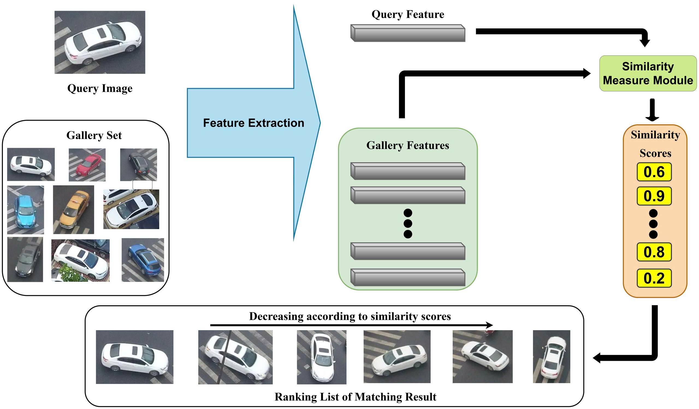
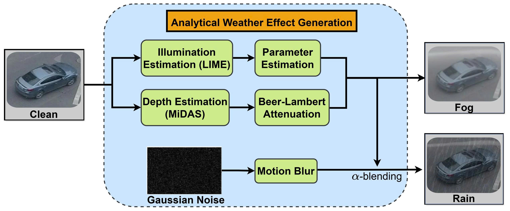

# Benchmarking UAV-based Vehicle Re-Identification under Simulated Weather Conditions

## Overview

This repository benchmarks UAV-based vehicle re-identification under simulated adverse weather conditions. We evaluate three representative ReID methods on VRU and UAV-VeID under clean, foggy, and rainy settings.

<p align="center">
  
</p>

- The implementation is organized based on the original repositories of the compared methods: [CLIP-ReID](https://github.com/Syliz517/CLIP-ReID), [MSINet](https://github.com/vimar-gu/MSINet), [AdaSP](https://github.com/Astaxanthin/AdaSP).
- The original method code is kept under `methods/` with minimal changes for running our benchmark protocol.

## Data
Please download the prepared datasets from the following [Google Drive link](https://drive.google.com/drive/folders/1rrK20QWPKBwt7XNklJFsekFHZMFYBfQI?usp=drive_link) and place them under the `data/` directory.

## Checkpoints
Please download the trained checkpoints from the following [Google Drive link](https://drive.google.com/drive/folders/1U9K7jMQRmBGSWC76Cd0YUsEWcSKR_Dop?usp=drive_link) and place them under the `checkpoints/` directory.

## Weather Generation

Weather-generation scripts are provided in: [data/gen_weathers/](/data/gen_weathers/)

<p align="center">
  
</p>

```bash
cd data/gen_weathers
python gen-fog-effect_subfolders.py
python gen-rain-effect_subfolders.py
```
## Running Experiments

### CLIP-ReID

```bash
cd methods/CLIP-ReID

# CNN-based CLIP-ReID baseline
CUDA_VISIBLE_DEVICES=0 python train.py \
  --config_file configs/vru/cnn_base.yml

CUDA_VISIBLE_DEVICES=0 python test.py \
  --config_file configs/vru/cnn_base.yml \
  TEST.WEIGHT ../../checkpoints/clip-reid/model.pth

# ViT-based CLIP-ReID
CUDA_VISIBLE_DEVICES=0 python train_clipreid.py \
  --config_file configs/vru/vit_prom.yml

CUDA_VISIBLE_DEVICES=0 python test_clipreid.py \
  --config_file configs/vru/vit_prom.yml \
  TEST.WEIGHT ../../checkpoints/clip-reid/model.pth
```

### MSINet

```bash
cd methods/MSINet

CUDA_VISIBLE_DEVICES=0 python train.py \
  -ds vru \
  --width 256

CUDA_VISIBLE_DEVICES=0 python test.py \
  -ds vru \
  --width 256 \
  --model-path ../../checkpoints/msinet/model.pth
```

### AdaSP
```bash
cd methods/AdaSP

CUDA_VISIBLE_DEVICES=0 python tools/train_net.py \
  --config-file configs/VRU/norm_CE_adasp.yml \
  MODEL.DEVICE "cuda:0"

CUDA_VISIBLE_DEVICES=0 python tools/train_net.py \
  --config-file configs/VRU/norm_CE_adasp.yml \
  --eval-only \
  MODEL.WEIGHTS ../../checkpoints/adasp/model.pth \
  MODEL.DEVICE "cuda:0"
```

## Citation

If you find this repository useful, please cite:

```bibtex
@inproceedings{tran2026benchmarking,
  title     = {Benchmarking UAV-based Vehicle Re-Identification under Simulated Weather Conditions},
  author    = {Tran, Vu Minh and Nguyen, Khang},
  booktitle = {Proceedings of the International Conference on Multimedia Analysis and Pattern Recognition},
  year      = {2026}
}
```